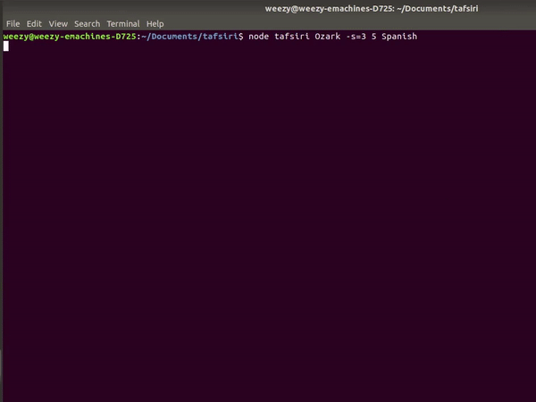

# Tafsiri

[](https://nodesource.com/products/nsolid)

Tafsiri is a command-line tool that enables subtitiles download for your favorite movies/shows in multiple languages.Tafsiri is also a Swahili word that means 'translate'.



# Features!

With Tafsiri you can do the following:

- Download subtitles by episodes or seasons
- Specify storage directory for downloaded subtitles
- Support for multiple languages

### Tech

Tafsiri uses a number of open source projects to work properly:

- Cheerio - A lightweight node js web scraper
- Got - Human-friendly and powerful HTTP request library
- Figlet - Node package that creates ASCII Art from text.
- Ora - An elegant terminal spinner
- Node.js - duh!

- Minimist - An argument parser for the command-line

And of course Tafsiri itself is open source with a [public repository][dill]
on GitHub.

### Installation

Tafsiri requires [Node.js](https://nodejs.org/) v14+ to run.

Install the dependencies and devDependencies and start the server.

```sh
$ cd tafsiri
$ npm install -d
$ node tafsiri

```

### Run

Tafsiri accepts a number of flags as input parameters(command-line-arguments)
| Flag | Function |
| ------ | ------ |
| -f | Film/Show |
| -s | Season |
| -e | Episode |
| -l | Language |
Tafsiri has to have a minimum of one flag to run

Example:

```sh
$ node tafsiri Ozark -s=3 5 Spanish
```

## License

MIT

**Free Software, Hell Yeah!**

[//]: # "These are reference links used in the body of this note and get stripped out when the markdown processor does its job. There is no need to format nicely because it shouldn't be seen. Thanks SO - http://stackoverflow.com/questions/4823468/store-comments-in-markdown-syntax"
[dill]: https://github.com/joemccann/dillinger
[git-repo-url]: https://github.com/joemccann/dillinger.git
[john gruber]: http://daringfireball.net
[df1]: http://daringfireball.net/projects/markdown/
[markdown-it]: https://github.com/markdown-it/markdown-it
[Ace Editor]: http://ace.ajax.org
[node.js]: http://nodejs.org
[Twitter Bootstrap]: http://twitter.github.com/bootstrap/
[jQuery]: http://jquery.com
[@tjholowaychuk]: http://twitter.com/tjholowaychuk
[express]: http://expressjs.com
[AngularJS]: http://angularjs.org
[Gulp]: http://gulpjs.com
[PlDb]: https://github.com/joemccann/dillinger/tree/master/plugins/dropbox/README.md
[PlGh]: https://github.com/joemccann/dillinger/tree/master/plugins/github/README.md
[PlGd]: https://github.com/joemccann/dillinger/tree/master/plugins/googledrive/README.md
[PlOd]: https://github.com/joemccann/dillinger/tree/master/plugins/onedrive/README.md
[PlMe]: https://github.com/joemccann/dillinger/tree/master/plugins/medium/README.md
[PlGa]: https://github.com/RahulHP/dillinger/blob/master/plugins/googleanalytics/README.md
